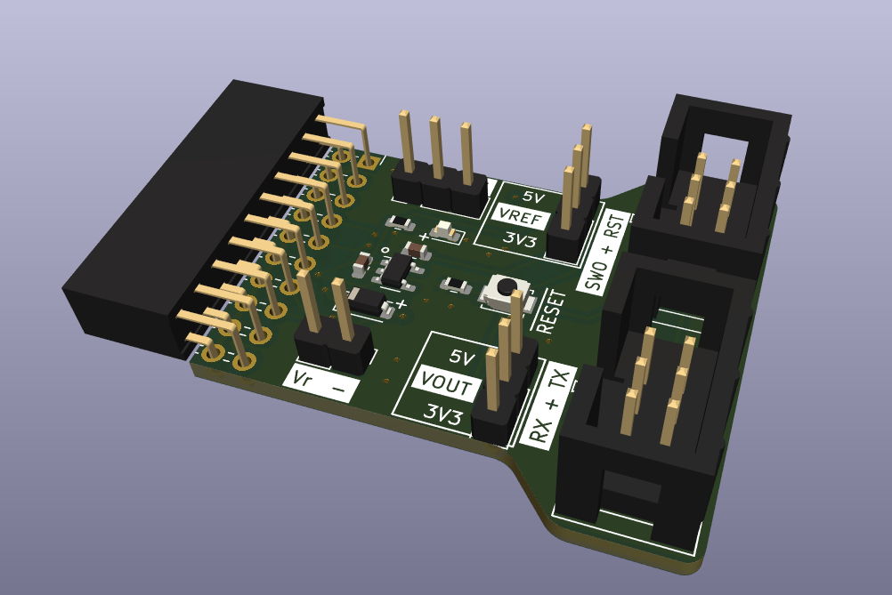

# tc2030-jlink-adapter

Adapter to adapt TC2030 to a JLINK Interface.

Works for both TC2030 and TC2030-NL. Contains an Alternative Layout with UART RX and TX on Pins 3 and 6.

# Warning: Not yet built and tested

